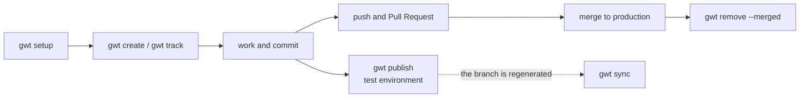
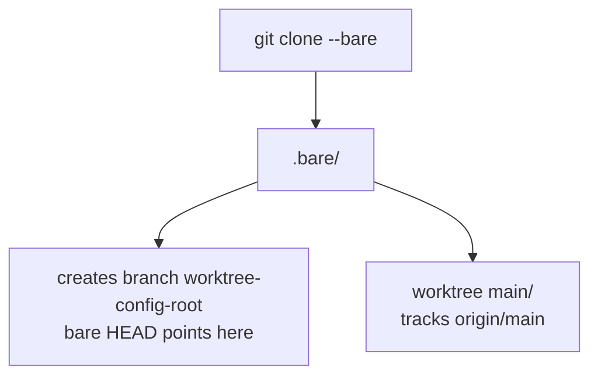
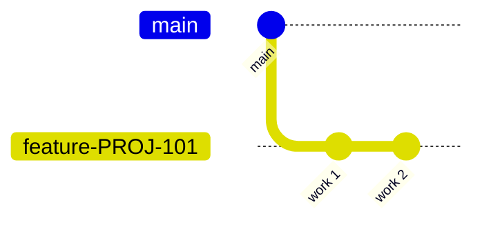
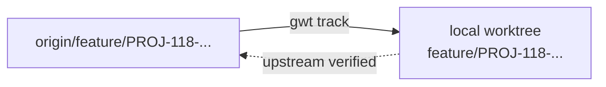
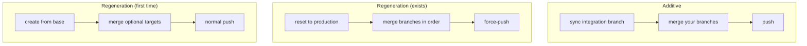
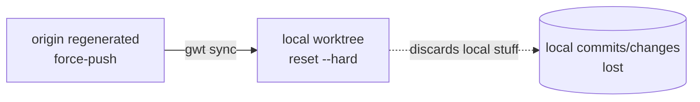
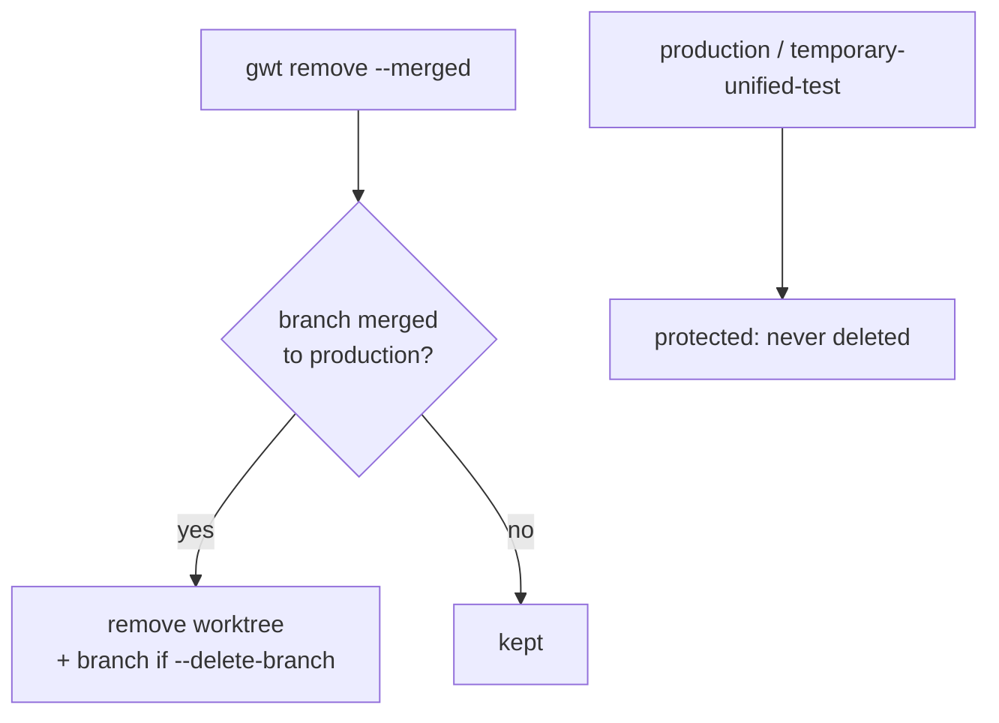
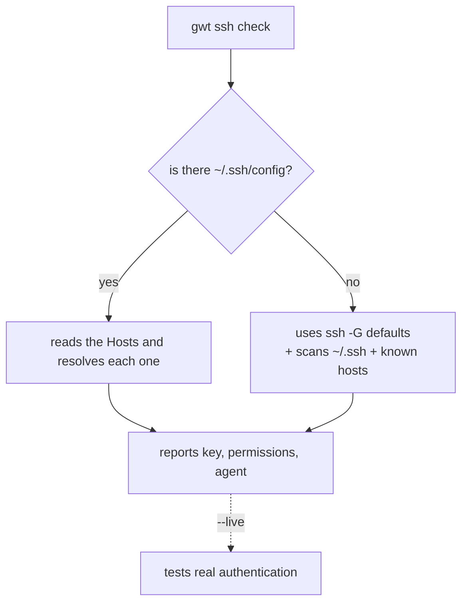
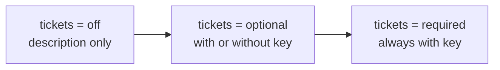

# grove Tutorial (`gwt`)

A hands-on guide to learning grove through complete workflows. Each section is a real scenario, with the commands, what you'll see, and why.

If you haven't installed it yet, go first to [INSTALL.md](INSTALL.md). For the dry reference of each command, see [USAGE.md](USAGE.md).

> **Prefer to drive grove from chat (an MCP agent) instead of the CLI?** These
> same flows, expressed as natural-language prompts mapped to grove's MCP tools,
> are in [MCP.md §9 — Conversational flows](MCP.md#9-conversational-flows-chat--grove-tools).

---

## Table of Contents

1. [Concepts in 2 minutes](#1-concepts-in-2-minutes)
2. [Flow A — Set up a repository from scratch](#2-flow-a--set-up-a-repository-from-scratch)
3. [Flow B — Work a ticket](#3-flow-b--work-a-ticket)
4. [Flow C — Resume a branch that already exists on the remote](#4-flow-c--resume-a-branch-that-already-exists-local-or-remote)
5. [Flow D — Publish to the shared test environment](#5-flow-d--publish-to-the-shared-test-environment)
6. [Flow E — Re-sync a branch that gets regenerated](#6-flow-e--re-sync-a-branch-that-gets-regenerated)
7. [Flow F — Close and clean up worktrees](#7-flow-f--close-and-clean-up-worktrees)
8. [Flow G — Repo hygiene with doctor](#8-flow-g--repo-hygiene-with-doctor)
9. [Flow H — SSH accounts: provision, choose and diagnose (multiple remotes)](#9-flow-h--ssh-accounts-provision-choose-and-diagnose-multiple-remotes)
10. [Flow I — Personal repos (personal profile)](#10-flow-i--personal-repos-personal-profile)
11. [Flow J — Automation and scripts (`--json`)](#11-flow-j--automation-and-scripts---json)
12. [Command cheat sheet](#12-command-cheat-sheet)

---

## 1. Concepts in 2 minutes

grove organizes each repository with the **bare model**: the "real" repository lives in `.bare/` and each branch you work on is a **sibling folder** (a *worktree*). This way you can have several branches open at once, each in its own folder, without constantly running `git checkout`.

```
my-repo/
├── .bare/                     # the (bare) repository + grove.toml (config)
├── main/                      # worktree of the base branch (main, or production depending on the profile)
├── temp/                      # experiments without a ticket
│   └── spike-cache/
├── feature/                   # TYPE folder
│   └── PROJ-101-login/        #   one worktree per ticket
├── hotfix/
│   └── PROJ-120-fix-payment/
└── release/
    └── v1.2.0/
```

(A work profile can add its own **special** branches, like an integration branch `temporary-unified-test` or `develop`; see Flows D–E.)

Two rules that explain almost everything:

- **The folder path = the branch name.** The folder `feature/PROJ-101-login` contains exactly the branch `feature/PROJ-101-login`.
- **Everything in its place:** ticket branches go inside their type folder (`feature/`, `hotfix/`, `bugfix/`); the base branch and integration branches are "special" (protected); `temp/` is for disposable stuff.

The typical lifecycle of a worktree:



---

## 2. Flow A — Set up a repository from scratch

**Goal:** clone a repo and leave it ready with grove's structure.

```
gwt setup git@github.com:acme/my-repo.git
```

What it does, step by step (you can see it with `-v`):

```
→ Profile: default (base main, tickets optional)
→ Cloning bare into my-repo/.bare
→ Configuring origin refspec
→ Creating parking branch worktree-config-root (base main)
→ Creating worktree main/ (origin/main)
✓ Repo my-repo ready
  .bare/   bare repository (+ grove.toml)
  main/    [tracks origin/main]
```

(With `--profile gitflow` or your own profile, the base can be `production`/`develop`, depending on how you define it.)

What happened under the hood:



> **Why the `worktree-config-root` branch?** In the bare model, the branch the `.bare`'s `HEAD` points to stays "occupied" and can't be used in a worktree. grove creates a parking branch for that, leaving the base branch free for its own folder.

Verify with:

```
cd my-repo
gwt list
```
```
FOLDER   BRANCH  TICKET  STATUS
(bare)   —       —       (bare)
main     main    —       ↑0 ↓0 clean
```

---

## 3. Flow B — Work a ticket

**Goal:** open a worktree for ticket `PROJ-101`, work on it, and push it.

```
gwt create PROJ-101 feature "login with SSO"
```
```
→ slug: login-with-sso
→ Validating: type feature ✓ · ticket folder=branch ✓
→ Creating worktree feature/PROJ-101-login-with-sso/ with new branch ... (base main)
✓ Worktree created: .../feature/PROJ-101-login-with-sso
```

> **You choose the name.** The third argument (`"login with SSO"`) is the *name* you give; grove only normalizes it to slug format (`login-with-sso`) — it doesn't summarize it or pull it from any external source. `create` is for **new** branches: if the branch already exists, it fails with a reason and sends you to `gwt track` (see Flow C).

The branch is born from the base branch (`main`):



You enter the folder and work like in any git repo:

```
cd feature/PROJ-101-login-with-sso
# ... you edit, git add, git commit ...
git push -u origin feature/PROJ-101-login-with-sso   # first push creates the branch on origin
```

> **Tip:** to jump straight into the freshly created folder:
> ```
> cd "$(gwt create PROJ-102 bugfix 'fix timeout' --print-path)"
> ```

At any time, `gwt list` shows you what each worktree is doing (ahead/behind relative to the remote, clean/dirty):

```
FOLDER                          BRANCH                          TICKET   STATUS
feature/PROJ-101-login-with-sso feature/PROJ-101-login-with-sso PROJ-101 ↑2 ↓0 dirty
main                            main                            —        ↑0 ↓0 clean
```

---

## 4. Flow C — Resume a branch that already exists (local or remote)

**Goal:** a branch already exists (a teammate created it on origin, or you have it locally without a worktree) and you want to work on it in the right location. `track` **places what already exists** — that's why the name is **derived from the branch** (you don't pass a slug) and it's more permissive than `create`.

```
gwt track feature/PROJ-118-payments-endpoint
```
```
→ Parsed: type=feature · PROJ-118
→ Creating worktree feature/PROJ-118-payments-endpoint/
→ Setting upstream -> origin/feature/PROJ-118-payments-endpoint
→ Verifying upstream ✓
✓ Branch brought in
```

It works with **origin and local** branches (local ones are left without upstream). grove deduces the location by mirroring the branch name.

**Permissive with the type.** If the branch has a type that's *not* in `allowed_types` (e.g. `chore/`), `track` **brings it in anyway** and just **warns** you — `allowed_types` restricts what `create` *makes*, not what `track` can *place*:

```
gwt track chore/PROJ-12345-cleanup-comments
# ! 'chore' is not in allowed_types; bringing the branch in anyway.
# ✓ Branch brought in: .../chore/PROJ-12345-cleanup-comments
```

Only if the branch is **not placeable** (it doesn't have the `<type>/...` form) do you need to indicate the target with `--as`:

```
gwt track urgent-fix --as hotfix/PROJ-130-urgent-fix
```

`track` also works for special branches (`production`, `temporary-unified-test`, `develop`).



---

## 5. Flow D — Publish to the shared test environment

**Goal:** push your work to the integration branch (`temporary-unified-test`) to deploy it to a test environment shared by several developers.

There are two ways, depending on how that branch is managed.

### Additive mode (add your changes to what's already there)

```
gwt publish PROJ-101
```
```
→ The integration branch 'temporary-unified-test' wasn't local; bringing it from origin
→ Syncing temporary-unified-test with origin
→ Merging feature/PROJ-101-login-with-sso
→ Push to origin/temporary-unified-test
✓ Published to temporary-unified-test: feature/PROJ-101-login-with-sso
```

### Regeneration mode (rebuild the branch from scratch with a set of branches)

```
gwt publish PROJ-101 PROJ-118 --regenerate
```
```
! --regenerate will rewrite origin/temporary-unified-test with a force-push (from production + 2 branch(es)).
Continue? [y/N] y
→ Regenerating temporary-unified-test from origin/production
→ Merging feature/PROJ-101-login-with-sso
→ Merging feature/PROJ-118-payments-endpoint
→ Force-push to origin/temporary-unified-test
✓ Published to temporary-unified-test: ...
```

### First time: create the integration branch from a base

If `temporary-unified-test` doesn't exist yet, the **same** `--regenerate` command **creates** it from `--base`. Because there's nothing to overwrite, it's a normal push — no force, no confirmation. Targets are optional, so you can seed it empty:

```
gwt publish --regenerate --base production
```
```
→ Integration branch 'temporary-unified-test' does not exist; creating it from production
→ Push to origin/temporary-unified-test
✓ Created temporary-unified-test: (no targets)
```

…or create it already including some tickets:

```
gwt publish PROJ-101 --regenerate --base production
```

After that first time, the regeneration example above (force-push, with confirmation) applies, since the branch now exists.

The paths, side by side:



> If a merge runs into a **conflict**, grove aborts and leaves the worktree clean for you to resolve by hand; nothing is published halfway.

---

## 6. Flow E — Re-sync a branch that gets regenerated

**Goal:** the shared test branch was regenerated/force-pushed by another process and your local copy ended up diverged. A normal `git pull` would break.

```
gwt sync temporary-unified-test
```

If you have local changes that would be lost, grove warns you beforehand:

```
! sync will discard on temporary-unified-test: 1 local commit(s) not pushed, uncommitted changes.
Continue? [y/N] y
→ Updating origin/temporary-unified-test
→ Resetting temporary-unified-test to origin/temporary-unified-test
✓ Worktree synced: temporary-unified-test
```

`sync` does a `fetch` + `reset --hard` to the origin's version (with `--clean` it also deletes untracked files). When inside the worktree, you can omit the name: `gwt sync`.



---

## 7. Flow F — Close and clean up worktrees

**Goal:** you no longer need a worktree (or several) and want to remove them without leaving junk behind.

Remove one (keeps the local branch for safety):

```
gwt remove PROJ-101
```

Remove and also delete the branch, only if it's already merged or pushed:

```
gwt remove PROJ-101 --delete-branch
```

Bulk cleanup: sweeps all ticket worktrees whose branch is already merged into the base. Try it first with `--dry-run`:

```
gwt remove --merged --dry-run
gwt remove --merged --delete-branch
```



> Safeguards: `production` and `temporary-unified-test` are protected; a worktree with uncommitted changes requires `--force`; and a branch that isn't pushed/merged isn't deleted unless `--force`.

---

## 8. Flow G — Repo hygiene with doctor

**Goal:** detect and fix accumulated messes (orphans, off-convention names, missing upstream, etc.).

First look without touching anything:

```
gwt doctor --dry-run
```
```
Problems found in my-repo:
  ✗ orphan           PROJ-90-old         entry without directory on disk      ->  git worktree prune
  ✗ release-format   release-v1.1.0      release format with hyphen           ->  rename to release/v1.1.0
  ✗ upstream         release/v1.1.0      no correct upstream                   ->  set-upstream origin/release/v1.1.0
  ! type-not-allowed chore/PROJ-12-x     type 'chore' is not in allowed_types  -> review (not moved)
  ! ticket           PROJ-22-x           folder ticket ≠ branch ticket         -> review manually
3 auto-fixable · 2 require manual review.
```

doctor separates two classes of findings:

- **Fixes automatically** (with `✗`): orphans, old release format, missing upstream, and misplaced folders whose branch *is* of an allowed type.
- **Reports only** (with `!`, never touches): a type outside `allowed_types` (like `chore/`, brought in with `track`) — warns that it doesn't conform to the config but **doesn't move it**; folder ticket ≠ branch ticket; nested worktrees. These are branches you brought in on purpose, so grove doesn't force changes.

Apply the automatic fixes (it asks for confirmation; `--fix` applies them without asking, ideal for CI; the "reports only" ones are never touched):

```
gwt doctor
```

---

## 9. Flow H — SSH accounts: provision, choose and diagnose (multiple remotes)

**Goal:** you work with the work remote and a personal one (sometimes on the same host, `github.com`, with different keys), and you want each repo to use the correct account and to be able to verify it.

### Provision an account end-to-end (`gwt ssh add`)

Before *choosing* an account per repo, you need the account to **exist** on your machine: a key, an `~/.ssh/config` entry, and (ideally) git identity routing so commits are signed with the right email. `gwt ssh add` does all of it in one idempotent step. This is machine-level — you don't need to be inside a repo.

The recommended layout puts each account's repos under its own folder, so the **folder decides everything**:

```
~/dropi/        # work: repos here use the Dropi key + dropi.co email
~/personal/     # personal: your personal key + personal email
```

Set up the work GitHub and Bitbucket accounts (both under `~/dropi/`, same email → same zone), and a personal one:

```
gwt ssh add dropi-gh   --host github.com    --email victor.orobio@dropi.co --scope-dir ~/dropi
gwt ssh add dropi-bb   --host bitbucket.org --email victor.orobio@dropi.co --scope-dir ~/dropi
gwt ssh add neytor-gh  --host github.com    --email me@example.com         --scope-dir ~/personal
```
```
→ generate key ~/.ssh/id_ed25519_dropi_gh
→ write ~/.ssh/config block [grove:account=dropi-gh]
→ route git@github.com: -> git@dropi-gh: (zone dropi, email victor.orobio@dropi.co)
→ harden ~/.gitconfig: user.useConfigOnly = true
✓ Account dropi-gh ready
  Upload this public key to github.com (Settings → SSH keys):
  ssh-ed25519 AAAA... dropi-gh
  Then verify:  gwt ssh check github.com --live
```

grove **prints the public key but never uploads it** — paste it into the host's SSH-keys page (or let an agent do it via its connector). After that, you clone with the **canonical URL** and the folder routes everything automatically:

```
cd ~/dropi/github
git clone git@github.com:gerenciadropi/backend.git   # rewritten to git@dropi-gh: → Dropi key + Dropi email
```

> **Why this is bulletproof.** The `Host` alias carries `IdentitiesOnly yes`; the zone's `insteadOf` rewrites canonical URLs to the alias (so you never type it); and `user.useConfigOnly = true` makes git refuse to invent an identity. Adding a second account on the same host later is just another `gwt ssh add` — nothing to migrate. Works on macOS, Linux and Windows (the Keychain step is macOS-only).

### See what you have (`gwt ssh accounts`)

```
gwt ssh accounts
```
```
ACCOUNT      HOST           KEY                          ZONE                          ROUTING
dropi-bb     bitbucket.org  id_ed25519_dropi_bb ✓ agent  ~/dropi/  victor.orobio@dropi.co  ✓
dropi-gh     github.com     id_ed25519_dropi_gh ✓ agent  ~/dropi/  victor.orobio@dropi.co  ✓
neytor-gh    github.com     id_ed25519_neytor_gh ✓ agent ~/personal/  me@example.com        ✓
```

`ROUTING ✓` means the SSH alias and the git identity routing are coherent. `--json` gives the same as a parseable object.

### Keep it healthy (`gwt ssh doctor`)

```
gwt ssh doctor
```

It detects and (with `--fix`) repairs the classic problems: a key with open permissions, a `Host` block missing `IdentitiesOnly`, a key not loaded in the agent, `user.useConfigOnly` unset, a missing `insteadOf` rewrite. It also **reports** (without touching) things that need your judgment: the host-vs-alias trap, an embedded token/secret in a `url.*` rewrite, orphans, or an unset global `user.name`. Exit code is `1` while problems remain, so it works as a CI gate.

### Remove an account (`gwt ssh remove`)

```
gwt ssh remove dropi-bb            # removes the Host block + its routing; keeps the key files
gwt ssh remove dropi-bb --delete-key
```

If the zone still has other accounts (here `dropi-gh` stays under `~/dropi/`), only `dropi-bb`'s routing is removed; the zone survives.

> The commands below (`ssh check`, `config set-ssh-alias`) are about *which existing account a given repo uses*; the ones above are about *provisioning the accounts themselves*. They compose: provision once with `ssh add`, then pick per repo.

### Choose the account when setting up the repo

The URL you copy from the remote is the **canonical** one (`git@github.com:org/repo.git`); it doesn't carry your local aliases. `setup` accepts it as-is, but if your `~/.ssh/config` has aliases for that host, it lets you choose:

```
gwt setup git@github.com:acme/backend.git
```
```
SSH aliases detected for github.com:
  1) gh-work   ~/.ssh/id_ed25519_github_work
  2) gh-personal      ~/.ssh/id_ed25519_github_personal
  0) use the URL as-is (no alias)
Which one to use? [0] 1
→ Using SSH alias 'gh-work' → git@gh-work:acme/backend.git
```

In scripts (no interaction) you choose it with the flag:

```
gwt setup git@github.com:acme/backend.git --ssh-alias gh-work
```

grove rewrites the `origin` to the alias and saves `ssh_alias` in the repo's config, so every `fetch`/`push` uses the right key without you thinking about it.

### Check and change the account later

```
gwt config                         # shows repo, origin, policy and ssh_alias
gwt config set-ssh-alias gh-personal     # changes the account (rewrites the origin)
gwt config set-ssh-alias none      # goes back to the canonical URL
```

`gwt config --json` returns all of that as a parseable object.

### Verify which key a repo will use

For the current repo:

```
gwt ssh check
```
```
Host: github.com
  HostName: github.com   User: git   IdentitiesOnly: no
  ✓ key ~/.ssh/id_personal — permissions ✓ · loaded in agent ✓
  agent: 2 key(s) loaded
```

Overview of your whole `~/.ssh/config`, and with a real authentication test:

```
gwt ssh check --all
gwt ssh check git@github.com:acme/my-repo.git --live
```

### No `~/.ssh/config`?

No problem: many people use SSH only with the default key (`id_ed25519`/`id_rsa`) without a config file. grove handles it:

- The **contextual** diagnostic still works (it relies on `ssh -G`, which uses the default values). It shows only the keys that exist and warns you that there's no config:

  ```
  gwt ssh check git@github.com:acme/my-repo.git
  ```
  ```
  Host: github.com
    HostName: github.com   User: git   IdentitiesOnly: no
    ! no ~/.ssh/config: ssh will use default keys or the agent
    ✓ key ~/.ssh/id_ed25519 — permissions ✓
    → suggestion: add --live to test real authentication
  ```

- In `--all` mode, since there's no `Host` to list, grove gives an **alternative overview**: the keys present in `~/.ssh`, the agent's status, and a diagnostic of known git hosts (`github.com`, `bitbucket.org`, `gitlab.com` by default; configurable with `known_git_hosts`):

  ```
  gwt ssh check --all
  ```

- If there's no key on disk but the agent has one loaded, grove marks it as valid (it can authenticate). If there's neither, it warns and suggests `--live` or generating/loading a key.

It's **read-only**: it never modifies your SSH configuration.



---

## 10. Flow I — Personal repos (personal profile)

**Goal:** use grove on your personal projects, where you (still) don't use tickets and your base branch is `main`.

```
gwt setup git@github.com:youruser/project.git --profile personal
```

With the `personal` profile, the repo's policy changes: base `main`, types `feature`/`fix`, and `tickets = optional`. That lets you create worktrees **without** a ticket:

```
gwt create feature "dark mode"      # -> feature/dark-mode
```

and, the day you adopt a ticket system, you simply start passing them (the `optional` mode detects them):

```
gwt create JIRA-9 fix "fix login"  # -> fix/JIRA-9-fix-login
```



The policy lives in `.bare/grove.toml` and you can adjust it whenever you want (see the configuration section in [USAGE.md](USAGE.md)).

> **Multiple ticket keys.** If a repo uses more than one project (e.g. `PROJ-` and `OPS-`), define them with `ticket_prefixes = ["DROP", "OPS"]` in `.bare/grove.toml`; grove will accept both and reject the rest. Without configuring anything, the generic pattern already recognizes any Jira-style key.

---

## 11. Flow J — Automation and scripts (`--json`)

**Goal:** use grove from a script or CI pipeline, where you need to know for certain whether a command worked and **why** if it failed — without parsing text or guessing from the exit code.

Any command accepts the global `--json` flag, which emits a single object with the status, the reason, and the result data:

```
gwt create PROJ-101 feature "login with SSO" --json
```
```json
{
  "command": "create",
  "status": "ok",
  "exit_code": 0,
  "message": "Worktree created: .../feature/PROJ-101-login-with-sso",
  "result": { "path": "...", "rel_path": "feature/PROJ-101-login-with-sso", "branch": "feature/PROJ-101-login-with-sso" },
  "log": ["slug: login-with-sso", "..."]
}
```

If something fails, the reason comes explicit in `message` and the type in `error_type`:

```json
{ "command": "create", "status": "error", "exit_code": 1,
  "error_type": "ValidationError",
  "message": "Type 'chore' not allowed. Valid types: feature, hotfix, bugfix." }
```

Example usage in bash:

```bash
out=$(gwt create PROJ-101 feature "login" --json)
if [ "$(echo "$out" | jq -r .status)" = "ok" ]; then
  cd "$(echo "$out" | jq -r .result.path)"
else
  echo "Failed: $(echo "$out" | jq -r .message)" >&2
fi
```

Two things to remember in `--json` mode:

- The output on stdout is **only** the JSON (the steps go inside `log`).
- There are no interactive confirmations: destructive operations (`sync`, `publish --regenerate`, `remove`) require `--yes`/`--force`; if they're missing, the command returns a `status: error` explaining it instead of hanging and waiting.

---

## 12. Command cheat sheet

| I want to... | Command |
|---|---|
| Set up a repo | `gwt setup <url> [--profile <p>]` |
| See my worktrees | `gwt list` |
| Open a ticket | `gwt create PROJ-1 feature "desc"` |
| Create a release | `gwt create release v1.2.0` |
| Experiment without a ticket | `gwt create temp <name>` |
| Bring a branch from origin | `gwt track <branch> [--as ...]` |
| Publish to test (add) | `gwt publish PROJ-1` |
| Publish to test (rebuild) | `gwt publish PROJ-1 PROJ-2 --regenerate` |
| Re-sync a regenerated branch | `gwt sync <branch>` |
| Remove a worktree | `gwt remove PROJ-1 [--delete-branch]` |
| Clean up what's already merged | `gwt remove --merged --delete-branch` |
| Review/fix hygiene | `gwt doctor [--fix]` |
| View/adjust the repo config | `gwt config [--json]` · `gwt config set-ssh-alias <alias>` |
| Sync status between branches | `gwt compare [<a>] [<b>]` · `gwt compare --vs main` |
| Generate a patch | `gwt patch [<worktree>] [--format-patch] [--wip]` |
| Local artifacts folder | `gwt artifacts [<worktree>]` |
| Choose SSH account at setup | `gwt setup <url> --ssh-alias <alias>` |
| Provision an SSH account | `gwt ssh add <name> --host <h> --email <e> --scope-dir <dir>` |
| List provisioned accounts | `gwt ssh accounts` |
| Diagnose/repair the SSH setup | `gwt ssh doctor [--fix]` |
| Remove an account | `gwt ssh remove <name> [--delete-key]` |
| Diagnose a remote's SSH | `gwt ssh check [--all] [--live]` |

> Almost all of them accept `--dry-run` to see what they would do, `-v` to show each underlying git command, and `--json` for parseable output with status and reason.
